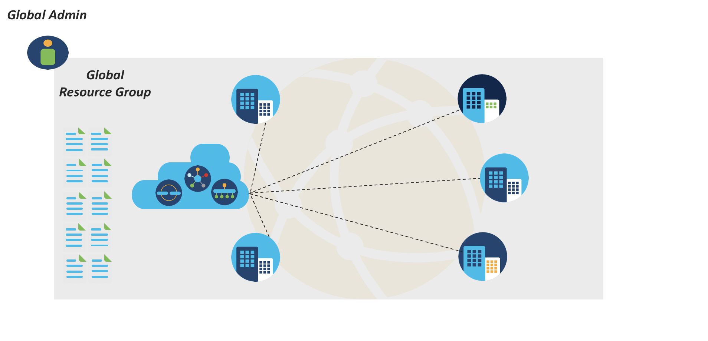
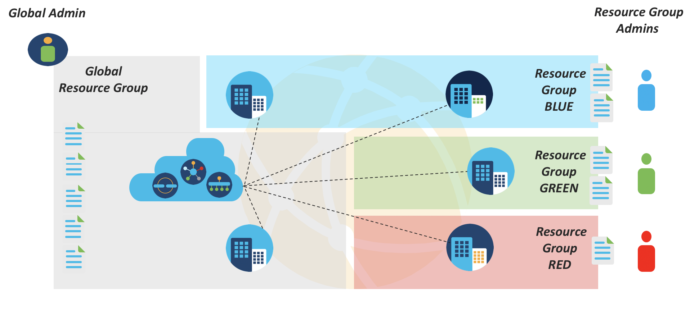
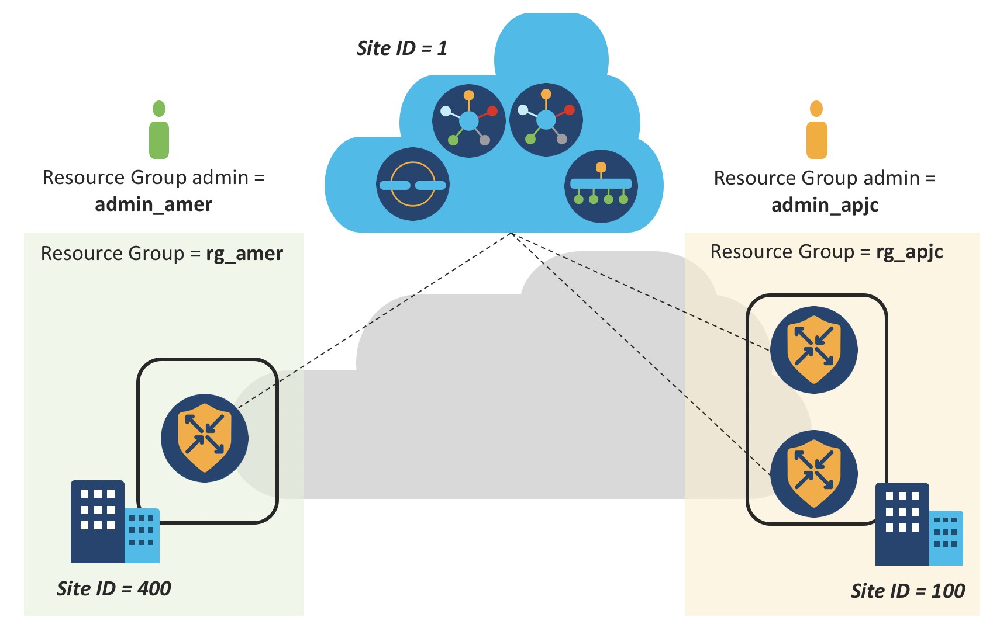

# RBAC based on Resource Groups feature using APIs
## Role-Based Access Control Groups Feature Overview

For large SD-WAN deployments, this feature helps to simplify the network administration, restrict blast perimeter, and meet compliance requirements.
 
Resource consists of Devices/Sites and Templates.
 
Resource Groups are groupings of resources based on continents/countries/regions/cities/areas etc.
 

## Demo Lab Topology
 

## Requirements

    Python 3.8+

## Installation

Creating Python virtual environment

    python3 -m venv env
    . env/bin/activate

Clone the Git Repo:

        git clone https://github.com/sbarissonmez/sdwan-rbac-resource-group
    
Install python package requirements:
    
        pip install -r requirements.txt

## Environment variables
 
export vmanage_host=IP/FQDN  
export vmanage_port=port  
export vmanage_username=username  
export vmanage_password=password  
 

    Example:
        export vmanage_host=128.107.222.8
        export vmanage_port=8443
        export vmanage_username=admin
        export vmanage_password=pocadmin
 

## Introduction

Python script to execute below REST API calls for showcasing the RBAC based on Resource Groups feature.

 

## Script overview
        
      $ ./sdwan_rbac_resource_groups.py
      
      Usage: sdwan_rbac_resource_groups.py [OPTIONS] COMMAND [ARGS]...
      
        Command line tool for monitoring Cisco SD-WAN solution components.
        
      Options:
        --help  Show this message and exit.
        
      Commands:
        create-banner-ft-user     create banner feature template for user.
        create-resource-group     Create Resource Group.
        create-user               Create User.
        delete-resource-group     Delete Resource Group.
        delete-user               Delete User.
        device-list-user          Get network devices list for RG admin.
        get-device-list           Get network devices list for global admin.
        get-nd-ft-user            Get non-default feature templates list for user.
        get-rg-list               Get Resource Group list for global admin.
        get-user-list             Get user list for global admin.
        modify-ft-resource-group  Modify Feature template resource group.
         
  
  

## View List of Devices, Users and Resource-Groups

### Global Admin: View Devices list

      ./sdwan_rbac_resource_groups.py get-device-list

        Retrieving the devices for global admin.

        GET
        https://128.107.222.8:8443/dataservice/device

        ╒═══════════════╤═══════════════╤══════════════════════════════════════════╤═════════════╤═══════════╤═════════════════╕
        │ Host-Name     │ Device Type   │ Device ID                                │ System IP   │   Site ID │ Device Model    │
        ╞═══════════════╪═══════════════╪══════════════════════════════════════════╪═════════════╪═══════════╪═════════════════╡
        │ vManage       │ vmanage       │ f87f01dc-c662-464e-9982-5c11d67ed050     │ 1.1.1.1     │         1 │ vmanage         │
        ├───────────────┼───────────────┼──────────────────────────────────────────┼─────────────┼───────────┼─────────────────┤
        │ vSmart-1      │ vsmart        │ 7767c213-8862-4eb8-98a7-97e57407789c     │ 1.1.1.3     │         1 │ vsmart          │
        ├───────────────┼───────────────┼──────────────────────────────────────────┼─────────────┼───────────┼─────────────────┤
        │ vSmart-2      │ vsmart        │ 431234c6-4027-4137-a24f-fadaf7a7b1f4     │ 1.1.1.4     │         1 │ vsmart          │
        ├───────────────┼───────────────┼──────────────────────────────────────────┼─────────────┼───────────┼─────────────────┤
        │ vBond         │ vbond         │ 52a667e7-85a3-4f83-b469-208613d185cd     │ 1.1.1.2     │         1 │ vedge-cloud     │
        ├───────────────┼───────────────┼──────────────────────────────────────────┼─────────────┼───────────┼─────────────────┤
        │ CSRSD-WAN-New │ vedge         │ CSR-13C1E07F-88DC-4BD2-98C8-CFFE80B836C4 │ 1.1.1.5     │       400 │ vedge-CSR-1000v │
        ├───────────────┼───────────────┼──────────────────────────────────────────┼─────────────┼───────────┼─────────────────┤
        │ Site100-cE1   │ vedge         │ CSR-C2F64427-7D0B-48CD-8D49-A27924ED7D1D │ 1.1.10.1    │       100 │ vedge-CSR-1000v │
        ├───────────────┼───────────────┼──────────────────────────────────────────┼─────────────┼───────────┼─────────────────┤
        │ Site100-cE2   │ vedge         │ CSR-FA7B0A20-10D6-4A69-9F5A-10FDF444989B │ 1.1.10.2    │       100 │ vedge-CSR-1000v │
        ╘═══════════════╧═══════════════╧══════════════════════════════════════════╧═════════════╧═══════════╧═════════════════╛

### Global Admin: View Users list

      ./sdwan_rbac_resource_groups.py get-user-list

        Retrieving the user list for global admin.

        GET
        https://128.107.222.8:8443/dataservice/admin/user

        ╒═════════════╤══════════════╤══════════════════╤═══════════════╕
        │ User-Name   │ User Group   │ Resource Group   │ Description   │
        ╞═════════════╪══════════════╪══════════════════╪═══════════════╡
        │ admin       │ []           │                  │               │
        ╘═════════════╧══════════════╧══════════════════╧═══════════════╛

### Global Admin: View Resource-Groups list

      ./sdwan_rbac_resource_groups.py get-rg-list

        Retrieving the Resource Group list for global admin.

        GET
        https://128.107.222.8:8443/dataservice/admin/resourcegroup

        ╒══════════════════════════════════════╤══════════════════╤════════════╤═════════════════════════════════╕
        │ ID                                   │ Resource Group   │ Site IDs   │ Description                     │
        ╞══════════════════════════════════════╪══════════════════╪════════════╪═════════════════════════════════╡
        │ 0:RESOURCE_GROUPNode:1615229358903:2 │ global           │ []         │ System defined group for global │
        ╘══════════════════════════════════════╧══════════════════╧════════════╧═════════════════════════════════╛

 

## Create Resource Groups and Resource Group Admins, Verify

### Global Admin: Create two Resource-Groups

      ./sdwan_rbac_resource_groups.py create-resource-group --rg_name "rg_apjc" --rg_desc "APJC Resource Group" --site_ids "100"

        Create Resource Group.

        POST
        https://128.107.222.8:8443/dataservice/admin/resourcegroup

        Payload
        {'name': 'rg_apjc', 'desc': 'APJC Resource Group', 'siteIds': ['100']}

        Successfully created resource group (200)

 

      ./sdwan_rbac_resource_groups.py create-resource-group --rg_name "rg_amer" --rg_desc "Americas Resource Group" --site_ids "400"

        Create Resource Group.

        POST
        https://128.107.222.8:8443/dataservice/admin/resourcegroup

        Payload
        {'name': 'rg_amer', 'desc': 'Americas Resource Group', 'siteIds': ['400']}

        Successfully created resource group (200)

### Global Admin: View Resource-Groups list

      ./sdwan_rbac_resource_groups.py get-rg-list
 

        Retrieving the Resource Group list for global admin.

        GET
        https://128.107.222.8:8443/dataservice/admin/resourcegroup

        ╒════════════════════════════════════════╤══════════════════╤════════════╤═════════════════════════════════╕
        │ ID                                     │ Resource Group   │ Site IDs   │ Description                     │
        ╞════════════════════════════════════════╪══════════════════╪════════════╪═════════════════════════════════╡
        │ 0:RESOURCE_GROUPNode:1615229358903:2   │ global           │ []         │ System defined group for global │
        ├────────────────────────────────────────┼──────────────────┼────────────┼─────────────────────────────────┤
        │ 0:RESOURCE_GROUPNode:1621946187787:109 │ rg_apjc          │ [100]      │ APJC Resource Group             │
        ├────────────────────────────────────────┼──────────────────┼────────────┼─────────────────────────────────┤
        │ 0:RESOURCE_GROUPNode:1621946207551:111 │ rg_amer          │ [400]      │ Americas Resource Group         │
        ╘════════════════════════════════════════╧══════════════════╧════════════╧═════════════════════════════════╛

### Global Admin: Create two Users

      ./sdwan_rbac_resource_groups.py create-user --u_name "admin_apjc" --u_pass "admin_apjc_pass" --u_desc "Admin for APJC" --u_group "resource_group_admin" --r_group "rg_apjc"

        Create User.

        POST
        https://128.107.222.8:8443/dataservice/admin/user

        Payload
        {'userName': 'admin_apjc', 'password': 'admin_apjc_pass', 'description': 'Admin for APJC', 'resGroupName': 'rg_apjc', 'group': ['resource_group_admin']}

        Successfully created user (200)

 

      ./sdwan_rbac_resource_groups.py create-user --u_name "admin_amer" --u_pass "admin_amer_pass" --u_desc "Admin for Americas" --u_group "resource_group_admin" --r_group "rg_amer"

        Create User.

        POST
        https://128.107.222.8:8443/dataservice/admin/user

        Payload
        {'userName': 'admin_amer', 'password': 'admin_amer_pass', 'description': 'Admin for Americas', 'resGroupName': 'rg_amer', 'group': ['resource_group_admin']}

        Successfully created user (200)

### Global Admin: View Users list

      ./sdwan_rbac_resource_groups.py get-user-list

        Retrieving the user list for global admin.

        GET
        https://128.107.222.8:8443/dataservice/admin/user

        ╒═════════════╤══════════════════════════╤══════════════════╤════════════════════╕
        │ User-Name   │ User Group               │ Resource Group   │ Description        │
        ╞═════════════╪══════════════════════════╪══════════════════╪════════════════════╡
        │ admin       │ []                       │                  │                    │
        ├─────────────┼──────────────────────────┼──────────────────┼────────────────────┤
        │ admin_amer  │ ['resource_group_admin'] │ rg_amer          │ Admin for Americas │
        ├─────────────┼──────────────────────────┼──────────────────┼────────────────────┤
        │ admin_apjc  │ ['resource_group_admin'] │ rg_apjc          │ Admin for APJC     │
        ╘═════════════╧══════════════════════════╧══════════════════╧════════════════════╛

#### NOTE:

##### Global Admin: Delete User and Resource-Group

      ./sdwan_rbac_resource_groups.py delete-user --u_name testuser
      
      ./sdwan_rbac_resource_groups.py delete-resource-group --rg_id "<id>"
      

 

## Verify Device access for Global Admin and Resource Group Admins

### Global Admin: View Devices list

      ./sdwan_rbac_resource_groups.py get-device-list

        Retrieving the devices for global admin.

        GET
        https://128.107.222.8:8443/dataservice/device

        ╒═══════════════╤═══════════════╤══════════════════════════════════════════╤═════════════╤═══════════╤═════════════════╕
        │ Host-Name     │ Device Type   │ Device ID                                │ System IP   │   Site ID │ Device Model    │
        ╞═══════════════╪═══════════════╪══════════════════════════════════════════╪═════════════╪═══════════╪═════════════════╡
        │ vManage       │ vmanage       │ f87f01dc-c662-464e-9982-5c11d67ed050     │ 1.1.1.1     │         1 │ vmanage         │
        ├───────────────┼───────────────┼──────────────────────────────────────────┼─────────────┼───────────┼─────────────────┤
        │ vSmart-1      │ vsmart        │ 7767c213-8862-4eb8-98a7-97e57407789c     │ 1.1.1.3     │         1 │ vsmart          │
        ├───────────────┼───────────────┼──────────────────────────────────────────┼─────────────┼───────────┼─────────────────┤
        │ vSmart-2      │ vsmart        │ 431234c6-4027-4137-a24f-fadaf7a7b1f4     │ 1.1.1.4     │         1 │ vsmart          │
        ├───────────────┼───────────────┼──────────────────────────────────────────┼─────────────┼───────────┼─────────────────┤
        │ vBond         │ vbond         │ 52a667e7-85a3-4f83-b469-208613d185cd     │ 1.1.1.2     │         1 │ vedge-cloud     │
        ├───────────────┼───────────────┼──────────────────────────────────────────┼─────────────┼───────────┼─────────────────┤
        │ CSRSD-WAN-New │ vedge         │ CSR-13C1E07F-88DC-4BD2-98C8-CFFE80B836C4 │ 1.1.1.5     │       400 │ vedge-CSR-1000v │
        ├───────────────┼───────────────┼──────────────────────────────────────────┼─────────────┼───────────┼─────────────────┤
        │ Site100-cE1   │ vedge         │ CSR-C2F64427-7D0B-48CD-8D49-A27924ED7D1D │ 1.1.10.1    │       100 │ vedge-CSR-1000v │
        ├───────────────┼───────────────┼──────────────────────────────────────────┼─────────────┼───────────┼─────────────────┤
        │ Site100-cE2   │ vedge         │ CSR-FA7B0A20-10D6-4A69-9F5A-10FDF444989B │ 1.1.10.2    │       100 │ vedge-CSR-1000v │
        ╘═══════════════╧═══════════════╧══════════════════════════════════════════╧═════════════╧═══════════╧═════════════════╛

Observe that all Devices are accessible.

### Resoruce Group Admin APJC: View Devices list

      ./sdwan_rbac_resource_groups.py device-list-user --username admin_apjc --password admin_apjc_pass

        Retrieving the devices for specified user.

        GET
        https://128.107.222.8:8443/dataservice/device

        ╒═════════════╤═══════════════╤══════════════════════════════════════════╤═════════════╤═══════════╤═════════════════╕
        │ Host-Name   │ Device Type   │ Device ID                                │ System IP   │   Site ID │ Device Model    │
        ╞═════════════╪═══════════════╪══════════════════════════════════════════╪═════════════╪═══════════╪═════════════════╡
        │ vManage     │ vmanage       │ f87f01dc-c662-464e-9982-5c11d67ed050     │ 1.1.1.1     │         1 │ vmanage         │
        ├─────────────┼───────────────┼──────────────────────────────────────────┼─────────────┼───────────┼─────────────────┤
        │ vSmart-1    │ vsmart        │ 7767c213-8862-4eb8-98a7-97e57407789c     │ 1.1.1.3     │         1 │ vsmart          │
        ├─────────────┼───────────────┼──────────────────────────────────────────┼─────────────┼───────────┼─────────────────┤
        │ vSmart-2    │ vsmart        │ 431234c6-4027-4137-a24f-fadaf7a7b1f4     │ 1.1.1.4     │         1 │ vsmart          │
        ├─────────────┼───────────────┼──────────────────────────────────────────┼─────────────┼───────────┼─────────────────┤
        │ vBond       │ vbond         │ 52a667e7-85a3-4f83-b469-208613d185cd     │ 1.1.1.2     │         1 │ vedge-cloud     │
        ├─────────────┼───────────────┼──────────────────────────────────────────┼─────────────┼───────────┼─────────────────┤
        │ Site100-cE1 │ vedge         │ CSR-C2F64427-7D0B-48CD-8D49-A27924ED7D1D │ 1.1.10.1    │       100 │ vedge-CSR-1000v │
        ├─────────────┼───────────────┼──────────────────────────────────────────┼─────────────┼───────────┼─────────────────┤
        │ Site100-cE2 │ vedge         │ CSR-FA7B0A20-10D6-4A69-9F5A-10FDF444989B │ 1.1.10.2    │       100 │ vedge-CSR-1000v │
        ╘═════════════╧═══════════════╧══════════════════════════════════════════╧═════════════╧═══════════╧═════════════════╛

Observe that only devices in APJC resource group are accessible.
Devices in Global resource group are also visible, APJC resource group user can only view these devices, but cannot perform any operations on them.

### Resoruce Group Admin Americas: View Devices list

      ./sdwan_rbac_resource_groups.py device-list-user --username admin_amer --password admin_amer_pass

        Retrieving the devices for specified user.

        GET
        https://128.107.222.8:8443/dataservice/device

        ╒═══════════════╤═══════════════╤══════════════════════════════════════════╤═════════════╤═══════════╤═════════════════╕
        │ Host-Name     │ Device Type   │ Device ID                                │ System IP   │   Site ID │ Device Model    │
        ╞═══════════════╪═══════════════╪══════════════════════════════════════════╪═════════════╪═══════════╪═════════════════╡
        │ vManage       │ vmanage       │ f87f01dc-c662-464e-9982-5c11d67ed050     │ 1.1.1.1     │         1 │ vmanage         │
        ├───────────────┼───────────────┼──────────────────────────────────────────┼─────────────┼───────────┼─────────────────┤
        │ vSmart-1      │ vsmart        │ 7767c213-8862-4eb8-98a7-97e57407789c     │ 1.1.1.3     │         1 │ vsmart          │
        ├───────────────┼───────────────┼──────────────────────────────────────────┼─────────────┼───────────┼─────────────────┤
        │ vSmart-2      │ vsmart        │ 431234c6-4027-4137-a24f-fadaf7a7b1f4     │ 1.1.1.4     │         1 │ vsmart          │
        ├───────────────┼───────────────┼──────────────────────────────────────────┼─────────────┼───────────┼─────────────────┤
        │ vBond         │ vbond         │ 52a667e7-85a3-4f83-b469-208613d185cd     │ 1.1.1.2     │         1 │ vedge-cloud     │
        ├───────────────┼───────────────┼──────────────────────────────────────────┼─────────────┼───────────┼─────────────────┤
        │ CSRSD-WAN-New │ vedge         │ CSR-13C1E07F-88DC-4BD2-98C8-CFFE80B836C4 │ 1.1.1.5     │       400 │ vedge-CSR-1000v │
        ╘═══════════════╧═══════════════╧══════════════════════════════════════════╧═════════════╧═══════════╧═════════════════╛

Observe that only devices in Americas resource group are accessible.
Devices in Global resource group are also visible, Americas resource group user can only view these devices, but cannot perform any operations on them.

 

## Verify Template access for Global Admin and Resource Group Admins

### Global Admin: View list of Feature Templates 
(Resource Group, createdBy, updateBy)

      ./sdwan_rbac_resource_groups.py get-nd-ft-user --username admin --password pocadmin

        Retrieving the non-default feature templates for specified user.

        GET
        https://128.107.222.8:8443/dataservice/template/feature

        ╒═════════════════════════════════════════════════════════════════════════════════╤══════════════════════════════════════╤═══════════════════╤═════════════════╤═════════════╤═════════════════╕
        │ templateName                                                                    │ templateId                           │   devicesAttached │ resourceGroup   │ createdBy   │ lastUpdatedBy   │
        ╞═════════════════════════════════════════════════════════════════════════════════╪══════════════════════════════════════╪═══════════════════╪═════════════════╪═════════════╪═════════════════╡
        │ OMP_DC                                                                          │ 12d40f5b-f753-4c85-990e-b65bae15ceae │                 2 │ global          │ admin       │                 │
        ├─────────────────────────────────────────────────────────────────────────────────┼──────────────────────────────────────┼───────────────────┼─────────────────┼─────────────┼─────────────────┤
        │ OSPF_DC_VPN10                                                                   │ f929576d-fac9-4e1f-8c4a-484591da6b1a │                 2 │ global          │ admin       │                 │
        ├─────────────────────────────────────────────────────────────────────────────────┼──────────────────────────────────────┼───────────────────┼─────────────────┼─────────────┼─────────────────┤
        │ OSPF_DC_VPN11                                                                   │ 5a00c230-65b9-4b82-adbf-63e9323953e7 │                 2 │ global          │ admin       │                 │
        ├─────────────────────────────────────────────────────────────────────────────────┼──────────────────────────────────────┼───────────────────┼─────────────────┼─────────────┼─────────────────┤
        │ OSPF_DC_VPN12                                                                   │ 394b91fa-ff1e-448a-be42-e495df4d8dc8 │                 2 │ global          │ admin       │                 │
        ├─────────────────────────────────────────────────────────────────────────────────┼──────────────────────────────────────┼───────────────────┼─────────────────┼─────────────┼─────────────────┤
        │ OMP_Branches                                                                    │ 182662c3-5c49-4c80-acb9-9ad99ecc7d8a │                 0 │ global          │ admin       │                 │
        ├─────────────────────────────────────────────────────────────────────────────────┼──────────────────────────────────────┼───────────────────┼─────────────────┼─────────────┼─────────────────┤

        <snip>

Observe that all feature templates can be seen.
Has full access (edit).

### Resoruce Group Admin APJC: View list of Feature Templates 
(Resource Group, createdBy, updateBy)

      ./sdwan_rbac_resource_groups.py get-nd-ft-user --username admin_apjc --password admin_apjc_pass

        Retrieving the non-default feature templates for specified user.

        GET
        https://128.107.222.8:8443/dataservice/template/feature

        ╒═════════════════════════════════════════════════════════════════════════════════╤══════════════════════════════════════╤═══════════════════╤═════════════════╤═════════════╤═════════════════╕
        │ templateName                                                                    │ templateId                           │   devicesAttached │ resourceGroup   │ createdBy   │ lastUpdatedBy   │
        ╞═════════════════════════════════════════════════════════════════════════════════╪══════════════════════════════════════╪═══════════════════╪═════════════════╪═════════════╪═════════════════╡
        │ OMP_DC                                                                          │ 12d40f5b-f753-4c85-990e-b65bae15ceae │                 2 │ global          │ admin       │                 │
        ├─────────────────────────────────────────────────────────────────────────────────┼──────────────────────────────────────┼───────────────────┼─────────────────┼─────────────┼─────────────────┤
        │ OSPF_DC_VPN10                                                                   │ f929576d-fac9-4e1f-8c4a-484591da6b1a │                 2 │ global          │ admin       │                 │
        ├─────────────────────────────────────────────────────────────────────────────────┼──────────────────────────────────────┼───────────────────┼─────────────────┼─────────────┼─────────────────┤
        │ OSPF_DC_VPN11                                                                   │ 5a00c230-65b9-4b82-adbf-63e9323953e7 │                 2 │ global          │ admin       │                 │
        ├─────────────────────────────────────────────────────────────────────────────────┼──────────────────────────────────────┼───────────────────┼─────────────────┼─────────────┼─────────────────┤
        │ OSPF_DC_VPN12                                                                   │ 394b91fa-ff1e-448a-be42-e495df4d8dc8 │                 2 │ global          │ admin       │                 │
        ├─────────────────────────────────────────────────────────────────────────────────┼──────────────────────────────────────┼───────────────────┼─────────────────┼─────────────┼─────────────────┤
        │ OMP_Branches                                                                    │ 182662c3-5c49-4c80-acb9-9ad99ecc7d8a │                 0 │ global          │ admin       │                 │
        ├─────────────────────────────────────────────────────────────────────────────────┼──────────────────────────────────────┼───────────────────┼─────────────────┼─────────────┼─────────────────┤

        <snip>

Observe that all feature templates in Global Resource Group can be seen.
Has Read-only access to these templates.

### Resoruce Group Admin Americas: View list of Feature Templates 
(Resource Group, createdBy, updateBy)

      ./sdwan_rbac_resource_groups.py get-nd-ft-user --username admin_amer --password admin_amer_pass

        Retrieving the non-default feature templates for specified user.

        GET
        https://128.107.222.8:8443/dataservice/template/feature

        ╒═════════════════════════════════════════════════════════════════════════════════╤══════════════════════════════════════╤═══════════════════╤═════════════════╤═════════════╤═════════════════╕
        │ templateName                                                                    │ templateId                           │   devicesAttached │ resourceGroup   │ createdBy   │ lastUpdatedBy   │
        ╞═════════════════════════════════════════════════════════════════════════════════╪══════════════════════════════════════╪═══════════════════╪═════════════════╪═════════════╪═════════════════╡
        │ OMP_DC                                                                          │ 12d40f5b-f753-4c85-990e-b65bae15ceae │                 2 │ global          │ admin       │                 │
        ├─────────────────────────────────────────────────────────────────────────────────┼──────────────────────────────────────┼───────────────────┼─────────────────┼─────────────┼─────────────────┤
        │ OSPF_DC_VPN10                                                                   │ f929576d-fac9-4e1f-8c4a-484591da6b1a │                 2 │ global          │ admin       │                 │
        ├─────────────────────────────────────────────────────────────────────────────────┼──────────────────────────────────────┼───────────────────┼─────────────────┼─────────────┼─────────────────┤
        │ OSPF_DC_VPN11                                                                   │ 5a00c230-65b9-4b82-adbf-63e9323953e7 │                 2 │ global          │ admin       │                 │
        ├─────────────────────────────────────────────────────────────────────────────────┼──────────────────────────────────────┼───────────────────┼─────────────────┼─────────────┼─────────────────┤
        │ OSPF_DC_VPN12                                                                   │ 394b91fa-ff1e-448a-be42-e495df4d8dc8 │                 2 │ global          │ admin       │                 │
        ├─────────────────────────────────────────────────────────────────────────────────┼──────────────────────────────────────┼───────────────────┼─────────────────┼─────────────┼─────────────────┤
        │ OMP_Branches                                                                    │ 182662c3-5c49-4c80-acb9-9ad99ecc7d8a │                 0 │ global          │ admin       │                 │
        ├─────────────────────────────────────────────────────────────────────────────────┼──────────────────────────────────────┼───────────────────┼─────────────────┼─────────────┼─────────────────┤

        <snip>

Observe that all feature templates in Global Resource Group can be seen.
Has Read-only access to these templates.

 

## Create Templates as Resource Group Admins and Global Admin, Verify

### Resoruce Group Admin APJC: Create a Banner Feature Template, Verify

      ./sdwan_rbac_resource_groups.py create-banner-ft-user --file banner_apjc.yaml --username admin_apjc --password admin_apjc_pass

        Creating banner feature template based on yaml file details

        Created banner template ID: {'templateId': 'd69aa190-bb9d-44d1-b495-10120543f867'}

 

      ./sdwan_rbac_resource_groups.py get-nd-ft-user --username admin_apjc --password admin_apjc_pass

        Retrieving the non-default feature templates for specified user.

        GET
        https://128.107.222.8:8443/dataservice/template/feature

        ╒═════════════════════════════════════════════════════════════════════════════════╤══════════════════════════════════════╤═══════════════════╤═════════════════╤═════════════╤═════════════════╕
        │ templateName                                                                    │ templateId                           │   devicesAttached │ resourceGroup   │ createdBy   │ lastUpdatedBy   │
        ╞═════════════════════════════════════════════════════════════════════════════════╪══════════════════════════════════════╪═══════════════════╪═════════════════╪═════════════╪═════════════════╡
        │ OMP_DC                                                                          │ 12d40f5b-f753-4c85-990e-b65bae15ceae │                 2 │ global          │ admin       │                 │
        ├─────────────────────────────────────────────────────────────────────────────────┼──────────────────────────────────────┼───────────────────┼─────────────────┼─────────────┼─────────────────┤
        │ OSPF_DC_VPN10                                                                   │ f929576d-fac9-4e1f-8c4a-484591da6b1a │                 2 │ global          │ admin       │                 │
        ├─────────────────────────────────────────────────────────────────────────────────┼──────────────────────────────────────┼───────────────────┼─────────────────┼─────────────┼─────────────────┤
        │ OSPF_DC_VPN11                                                                   │ 5a00c230-65b9-4b82-adbf-63e9323953e7 │                 2 │ global          │ admin       │                 │
        ├─────────────────────────────────────────────────────────────────────────────────┼──────────────────────────────────────┼───────────────────┼─────────────────┼─────────────┼─────────────────┤
        │ OSPF_DC_VPN12                                                                   │ 394b91fa-ff1e-448a-be42-e495df4d8dc8 │                 2 │ global          │ admin       │                 │
        ├─────────────────────────────────────────────────────────────────────────────────┼──────────────────────────────────────┼───────────────────┼─────────────────┼─────────────┼─────────────────┤
        │ OMP_Branches                                                                    │ 182662c3-5c49-4c80-acb9-9ad99ecc7d8a │                 0 │ global          │ admin       │                 │
        ├─────────────────────────────────────────────────────────────────────────────────┼──────────────────────────────────────┼───────────────────┼─────────────────┼─────────────┼─────────────────

        <snip>

        ├─────────────────────────────────────────────────────────────────────────────────┼──────────────────────────────────────┼───────────────────┼─────────────────┼─────────────┼─────────────────┤
        │ Test_DT_banner_2                                                                │ 40436a3d-8198-4e30-b2d2-a669b94bfab7 │                 0 │ global          │ admin       │                 │
        ├─────────────────────────────────────────────────────────────────────────────────┼──────────────────────────────────────┼───────────────────┼─────────────────┼─────────────┼─────────────────┤
        │ vedge_cloud_banner_apjc                                                         │ d69aa190-bb9d-44d1-b495-10120543f867 │                 0 │ rg_apjc         │ admin_apjc  │                 │
        ╘═════════════════════════════════════════════════════════════════════════════════╧══════════════════════════════════════╧═══════════════════╧═════════════════╧═════════════╧═════════════════╛

All feature templates in Global Resource Group can be seen, Has Read-only access to these templates.
All feature templates in Resource Group APJC can also be seen, Has full access (edit).

### Resoruce Group Admin Americas: Create a Banner Feature Template, Verify

      ./sdwan_rbac_resource_groups.py create-banner-ft-user --file banner_amer.yaml --username admin_amer --password admin_amer_pass

        Creating banner feature template based on yaml file details

        Created banner template ID: {'templateId': 'd9b755bf-7678-4200-b4a6-40b4780f5ccc'}

 

      ./sdwan_rbac_resource_groups.py get-nd-ft-user --username admin_amer --password admin_amer_pass

        Retrieving the non-default feature templates for specified user.

        GET
        https://128.107.222.8:8443/dataservice/template/feature

        ╒═════════════════════════════════════════════════════════════════════════════════╤══════════════════════════════════════╤═══════════════════╤═════════════════╤═════════════╤═════════════════╕
        │ templateName                                                                    │ templateId                           │   devicesAttached │ resourceGroup   │ createdBy   │ lastUpdatedBy   │
        ╞═════════════════════════════════════════════════════════════════════════════════╪══════════════════════════════════════╪═══════════════════╪═════════════════╪═════════════╪═════════════════╡
        │ OMP_DC                                                                          │ 12d40f5b-f753-4c85-990e-b65bae15ceae │                 2 │ global          │ admin       │                 │
        ├─────────────────────────────────────────────────────────────────────────────────┼──────────────────────────────────────┼───────────────────┼─────────────────┼─────────────┼─────────────────┤
        │ OSPF_DC_VPN10                                                                   │ f929576d-fac9-4e1f-8c4a-484591da6b1a │                 2 │ global          │ admin       │                 │
        ├─────────────────────────────────────────────────────────────────────────────────┼──────────────────────────────────────┼───────────────────┼─────────────────┼─────────────┼─────────────────┤
        │ OSPF_DC_VPN11                                                                   │ 5a00c230-65b9-4b82-adbf-63e9323953e7 │                 2 │ global          │ admin       │                 │
        ├─────────────────────────────────────────────────────────────────────────────────┼──────────────────────────────────────┼───────────────────┼─────────────────┼─────────────┼─────────────────┤
        │ OSPF_DC_VPN12                                                                   │ 394b91fa-ff1e-448a-be42-e495df4d8dc8 │                 2 │ global          │ admin       │                 │
        ├─────────────────────────────────────────────────────────────────────────────────┼──────────────────────────────────────┼───────────────────┼─────────────────┼─────────────┼─────────────────┤
        │ OMP_Branches                                                                    │ 182662c3-5c49-4c80-acb9-9ad99ecc7d8a │                 0 │ global          │ admin       │                 │
        ├─────────────────────────────────────────────────────────────────────────────────┼──────────────────────────────────────┼───────────────────┼─────────────────┼─────────────┼─────────────────

        <snip>

        ├─────────────────────────────────────────────────────────────────────────────────┼──────────────────────────────────────┼───────────────────┼─────────────────┼─────────────┼─────────────────┤
        │ Test_DT_banner_2                                                                │ 40436a3d-8198-4e30-b2d2-a669b94bfab7 │                 0 │ global          │ admin       │                 │
        ├─────────────────────────────────────────────────────────────────────────────────┼──────────────────────────────────────┼───────────────────┼─────────────────┼─────────────┼─────────────────┤
        │ vedge_cloud_banner_amercas                                                      │ d9b755bf-7678-4200-b4a6-40b4780f5ccc │                 0 │ rg_amer         │ admin_amer  │                 │
        ╘═════════════════════════════════════════════════════════════════════════════════╧══════════════════════════════════════╧═══════════════════╧═════════════════╧═════════════╧═════════════════╛

All feature templates in Global Resource Group can be seen, Has Read-only access to these templates.
All feature templates in Resource Group Americas can also be seen, Has full access (edit).

### Global Admin: Create a Banner Feature Template, Verify

      ./sdwan_rbac_resource_groups.py create-banner-ft-user --file banner_global.yaml --username admin --password pocadmin

        Creating banner feature template based on yaml file details

        Created banner template ID: {'templateId': '18b13329-09e0-4158-a282-fe500ccbc6ad'}

 

      ./sdwan_rbac_resource_groups.py get-nd-ft-user --username admin --password pocadmin

        Retrieving the non-default feature templates for specified user.

        GET
        https://128.107.222.8:8443/dataservice/template/feature

        ╒═════════════════════════════════════════════════════════════════════════════════╤══════════════════════════════════════╤═══════════════════╤═════════════════╤═════════════╤═════════════════╕
        │ templateName                                                                    │ templateId                           │   devicesAttached │ resourceGroup   │ createdBy   │ lastUpdatedBy   │
        ╞═════════════════════════════════════════════════════════════════════════════════╪══════════════════════════════════════╪═══════════════════╪═════════════════╪═════════════╪═════════════════╡
        │ OMP_DC                                                                          │ 12d40f5b-f753-4c85-990e-b65bae15ceae │                 2 │ global          │ admin       │                 │
        ├─────────────────────────────────────────────────────────────────────────────────┼──────────────────────────────────────┼───────────────────┼─────────────────┼─────────────┼─────────────────┤
        │ OSPF_DC_VPN10                                                                   │ f929576d-fac9-4e1f-8c4a-484591da6b1a │                 2 │ global          │ admin       │                 │
        ├─────────────────────────────────────────────────────────────────────────────────┼──────────────────────────────────────┼───────────────────┼─────────────────┼─────────────┼─────────────────┤
        │ OSPF_DC_VPN11                                                                   │ 5a00c230-65b9-4b82-adbf-63e9323953e7 │                 2 │ global          │ admin       │                 │
        ├─────────────────────────────────────────────────────────────────────────────────┼──────────────────────────────────────┼───────────────────┼─────────────────┼─────────────┼─────────────────┤
        │ OSPF_DC_VPN12                                                                   │ 394b91fa-ff1e-448a-be42-e495df4d8dc8 │                 2 │ global          │ admin       │                 │
        ├─────────────────────────────────────────────────────────────────────────────────┼──────────────────────────────────────┼───────────────────┼─────────────────┼─────────────┼─────────────────┤
        │ OMP_Branches                                                                    │ 182662c3-5c49-4c80-acb9-9ad99ecc7d8a │                 0 │ global          │ admin       │                 │
        ├─────────────────────────────────────────────────────────────────────────────────┼──────────────────────────────────────┼───────────────────┼─────────────────┼─────────────┼─────────────────┤

        <snip>

        ├─────────────────────────────────────────────────────────────────────────────────┼──────────────────────────────────────┼───────────────────┼─────────────────┼─────────────┼─────────────────┤
        │ Test_DT_banner_2                                                                │ 40436a3d-8198-4e30-b2d2-a669b94bfab7 │                 0 │ global          │ admin       │                 │
        ├─────────────────────────────────────────────────────────────────────────────────┼──────────────────────────────────────┼───────────────────┼─────────────────┼─────────────┼─────────────────┤
        │ vedge_cloud_banner_apjc                                                         │ d69aa190-bb9d-44d1-b495-10120543f867 │                 0 │ rg_apjc         │ admin_apjc  │                 │
        ├─────────────────────────────────────────────────────────────────────────────────┼──────────────────────────────────────┼───────────────────┼─────────────────┼─────────────┼─────────────────┤
        │ vedge_cloud_banner_amercas                                                      │ d9b755bf-7678-4200-b4a6-40b4780f5ccc │                 0 │ rg_amer         │ admin_amer  │                 │
        ├─────────────────────────────────────────────────────────────────────────────────┼──────────────────────────────────────┼───────────────────┼─────────────────┼─────────────┼─────────────────┤
        │ vedge_cloud_banner_global                                                       │ 18b13329-09e0-4158-a282-fe500ccbc6ad │                 0 │ global          │ admin       │                 │
        ╘═════════════════════════════════════════════════════════════════════════════════╧══════════════════════════════════════╧═══════════════════╧═════════════════╧═════════════╧═════════════════╛

All feature templates can be seen, Has full access (edit).
All feature templates in Resource Group APJC and Americas also can also be seen, Has full access (edit).

 

## Change Template Resource Group and Verify
   NOTE: Template must NOT be attached to any device. Else, modification not allowed.

### Global Admin: Change Resource Group of Feature Template in APJC Resource Group, to global. Verify.
  (get template ID from get-nd-ft-user)

      ./sdwan_rbac_resource_groups.py modify-ft-resource-group --ft_id "<id>" --r_group "global"

         ./sdwan_rbac_resource_groups.py modify-ft-resource-group --ft_id "d69aa190-bb9d-44d1-b495-10120543f867" --r_group "global"

        Changing Resource Group for specified Feature Template.

        POST
        https://128.107.222.8:8443/dataservice/template/feature/resource-group/global/d69aa190-bb9d-44d1-b495-10120543f867

        Successfully changed Resource Group for template (200)

 

      ./sdwan_rbac_resource_groups.py get-nd-ft-user --username admin --password pocadmin

        Retrieving the non-default feature templates for specified user.

        GET
        https://128.107.222.8:8443/dataservice/template/feature

        ╒═════════════════════════════════════════════════════════════════════════════════╤══════════════════════════════════════╤═══════════════════╤═════════════════╤═════════════╤═════════════════╕
        │ templateName                                                                    │ templateId                           │   devicesAttached │ resourceGroup   │ createdBy   │ lastUpdatedBy   │
        ╞═════════════════════════════════════════════════════════════════════════════════╪══════════════════════════════════════╪═══════════════════╪═════════════════╪═════════════╪═════════════════╡
        │ OMP_DC                                                                          │ 12d40f5b-f753-4c85-990e-b65bae15ceae │                 2 │ global          │ admin       │                 │
        ├─────────────────────────────────────────────────────────────────────────────────┼──────────────────────────────────────┼───────────────────┼─────────────────┼─────────────┼─────────────────┤
        │ OSPF_DC_VPN10                                                                   │ f929576d-fac9-4e1f-8c4a-484591da6b1a │                 2 │ global          │ admin       │                 │
        ├─────────────────────────────────────────────────────────────────────────────────┼──────────────────────────────────────┼───────────────────┼─────────────────┼─────────────┼─────────────────┤
        │ OSPF_DC_VPN11                                                                   │ 5a00c230-65b9-4b82-adbf-63e9323953e7 │                 2 │ global          │ admin       │                 │
        ├─────────────────────────────────────────────────────────────────────────────────┼──────────────────────────────────────┼───────────────────┼─────────────────┼─────────────┼─────────────────┤
        │ OSPF_DC_VPN12                                                                   │ 394b91fa-ff1e-448a-be42-e495df4d8dc8 │                 2 │ global          │ admin       │                 │
        ├─────────────────────────────────────────────────────────────────────────────────┼──────────────────────────────────────┼───────────────────┼─────────────────┼─────────────┼─────────────────┤
        │ OMP_Branches                                                                    │ 182662c3-5c49-4c80-acb9-9ad99ecc7d8a │                 0 │ global          │ admin       │                 │
        ├─────────────────────────────────────────────────────────────────────────────────┼──────────────────────────────────────┼───────────────────┼─────────────────┼─────────────┼─────────────────┤

        <snip>

        ├─────────────────────────────────────────────────────────────────────────────────┼──────────────────────────────────────┼───────────────────┼─────────────────┼─────────────┼─────────────────┤
        │ Test_DT_banner_2                                                                │ 40436a3d-8198-4e30-b2d2-a669b94bfab7 │                 0 │ global          │ admin       │                 │
        ├─────────────────────────────────────────────────────────────────────────────────┼──────────────────────────────────────┼───────────────────┼─────────────────┼─────────────┼─────────────────┤
        │ vedge_cloud_banner_apjc                                                         │ d69aa190-bb9d-44d1-b495-10120543f867 │                 0 │ global          │ admin_apjc  │                 │
        ├─────────────────────────────────────────────────────────────────────────────────┼──────────────────────────────────────┼───────────────────┼─────────────────┼─────────────┼─────────────────┤
        │ vedge_cloud_banner_amercas                                                      │ d9b755bf-7678-4200-b4a6-40b4780f5ccc │                 0 │ rg_amer         │ admin_amer  │                 │
        ├─────────────────────────────────────────────────────────────────────────────────┼──────────────────────────────────────┼───────────────────┼─────────────────┼─────────────┼─────────────────┤
        │ vedge_cloud_banner_global                                                       │ 18b13329-09e0-4158-a282-fe500ccbc6ad │                 0 │ global          │ admin       │                 │
        ╘═════════════════════════════════════════════════════════════════════════════════╧══════════════════════════════════════╧═══════════════════╧═════════════════╧═════════════╧═════════════════╛

### Global Admin: Change Resource Group of Feature Template in Americas Resource Group, to APJC. Verify.
  (get template ID from get-nd-ft-user)

      ./sdwan_rbac_resource_groups.py modify-ft-resource-group --ft_id "<id>" --r_group "rg_apjc"

        ./sdwan_rbac_resource_groups.py modify-ft-resource-group --ft_id "d9b755bf-7678-4200-b4a6-40b4780f5ccc" --r_group "rg_apjc"

        Changing Resource Group for specified Feature Template.

        POST
        https://128.107.222.8:8443/dataservice/template/feature/resource-group/rg_apjc/d9b755bf-7678-4200-b4a6-40b4780f5ccc

        Successfully changed Resource Group for template (200)

 

      ./sdwan_rbac_resource_groups.py get-nd-ft-user --username admin --password pocadmin

        Retrieving the non-default feature templates for specified user.

        GET
        https://128.107.222.8:8443/dataservice/template/feature

        ╒═════════════════════════════════════════════════════════════════════════════════╤══════════════════════════════════════╤═══════════════════╤═════════════════╤═════════════╤═════════════════╕
        │ templateName                                                                    │ templateId                           │   devicesAttached │ resourceGroup   │ createdBy   │ lastUpdatedBy   │
        ╞═════════════════════════════════════════════════════════════════════════════════╪══════════════════════════════════════╪═══════════════════╪═════════════════╪═════════════╪═════════════════╡
        │ OMP_DC                                                                          │ 12d40f5b-f753-4c85-990e-b65bae15ceae │                 2 │ global          │ admin       │                 │
        ├─────────────────────────────────────────────────────────────────────────────────┼──────────────────────────────────────┼───────────────────┼─────────────────┼─────────────┼─────────────────┤
        │ OSPF_DC_VPN10                                                                   │ f929576d-fac9-4e1f-8c4a-484591da6b1a │                 2 │ global          │ admin       │                 │
        ├─────────────────────────────────────────────────────────────────────────────────┼──────────────────────────────────────┼───────────────────┼─────────────────┼─────────────┼─────────────────┤
        │ OSPF_DC_VPN11                                                                   │ 5a00c230-65b9-4b82-adbf-63e9323953e7 │                 2 │ global          │ admin       │                 │
        ├─────────────────────────────────────────────────────────────────────────────────┼──────────────────────────────────────┼───────────────────┼─────────────────┼─────────────┼─────────────────┤
        │ OSPF_DC_VPN12                                                                   │ 394b91fa-ff1e-448a-be42-e495df4d8dc8 │                 2 │ global          │ admin       │                 │
        ├─────────────────────────────────────────────────────────────────────────────────┼──────────────────────────────────────┼───────────────────┼─────────────────┼─────────────┼─────────────────┤
        │ OMP_Branches                                                                    │ 182662c3-5c49-4c80-acb9-9ad99ecc7d8a │                 0 │ global          │ admin       │                 │
        ├─────────────────────────────────────────────────────────────────────────────────┼──────────────────────────────────────┼───────────────────┼─────────────────┼─────────────┼─────────────────┤

        <snip>

        ├─────────────────────────────────────────────────────────────────────────────────┼──────────────────────────────────────┼───────────────────┼─────────────────┼─────────────┼─────────────────┤
        │ Test_DT_banner_2                                                                │ 40436a3d-8198-4e30-b2d2-a669b94bfab7 │                 0 │ global          │ admin       │                 │
        ├─────────────────────────────────────────────────────────────────────────────────┼──────────────────────────────────────┼───────────────────┼─────────────────┼─────────────┼─────────────────┤
        │ vedge_cloud_banner_apjc                                                         │ d69aa190-bb9d-44d1-b495-10120543f867 │                 0 │ global          │ admin_apjc  │                 │
        ├─────────────────────────────────────────────────────────────────────────────────┼──────────────────────────────────────┼───────────────────┼─────────────────┼─────────────┼─────────────────┤
        │ vedge_cloud_banner_amercas                                                      │ d9b755bf-7678-4200-b4a6-40b4780f5ccc │                 0 │ rg_apjc         │ admin_amer  │                 │
        ├─────────────────────────────────────────────────────────────────────────────────┼──────────────────────────────────────┼───────────────────┼─────────────────┼─────────────┼─────────────────┤
        │ vedge_cloud_banner_global                                                       │ 18b13329-09e0-4158-a282-fe500ccbc6ad │                 0 │ global          │ admin       │                 │
        ╘═════════════════════════════════════════════════════════════════════════════════╧══════════════════════════════════════╧═══════════════════╧═════════════════╧═════════════╧═════════════════╛

 